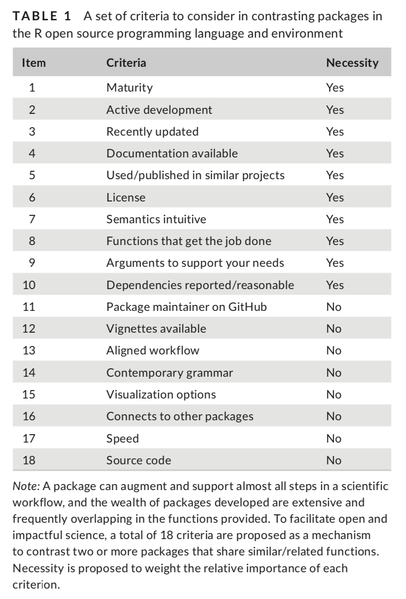

<!-- Following code to keep printed version cleaner; see https://stackoverflow.com/a/24467913/633251  -->
<style type="text/css" media="print">
a:link:after, a:visited:after {
  content: normal !important;
}
</style>


<!-- See https://kryogenix.org/code/browser/sorttable/ -->
<script src="sorttable.js"></script>

The following table collects information about free and open source software ([FOSS](https://en.wikipedia.org/wiki/Free_and_open-source_software)) for spectroscopy.  All information is taken from the respective websites and/or repositories.  Some projects have been described in publications.  If so, a link is provided, but the document may be behind a paywall.

Unless otherwise noted, the software mentioned here:

* Is suitable for one or more of the following techniques: NMR, IR, Raman, ESR/EPR, fluorescence, XRF, LIBS and UV-Vis.
* Mass *spectrometry* software is not included (see the work by Stanstrup just below).
* Software for MRI is not included.

[Stanstrup *et al.*](https://www.mdpi.com/2218-1989/9/10/200) have published a comprehensive paper describing the `R` packages suitable for use in metabolomics, which partially overlaps with the information here. The authors have also created a dynamic [document](https://rformassspectrometry.github.io/metaRbolomics-book/) with the same information and more.  In addition, [awesome-spectra](https://github.com/erwanp/awesome-spectra) is a page somewhat in the spirit of the work here, but apparently depends on authors to add their own material, and is missing some key entries (e.g. no NMR packages).

The [CRAN Task View for Chemometrics & Computational Physics](https://cran.r-project.org/web/views/ChemPhys.html) includes some `R` packages listed here as well as related software.

#### How Does One Choose a Package?

*The projects listed here have been lightly vetted. If a project looks incomplete, or I can't tell what it does, it's not included!* With that in mind, there are still many packages to consider.  As a general guide, the excellent checklist provided by [Lortie *et al.*](https://onlinelibrary.wiley.com/doi/full/10.1002/ece3.5970) is included here for your consideration.



```{r setupR, echo = FALSE, results = "hide"}
# Clean up the workspace but keep the local token, if present
# This is necessary for the local build
keep <- "github_token"
rm(list = ls()[!(ls() %in% keep)])

suppressPackageStartupMessages(library("knitr"))
suppressPackageStartupMessages(library("kableExtra"))
suppressPackageStartupMessages(library("readxl"))
suppressPackageStartupMessages(library("httr"))
suppressPackageStartupMessages(library("lubridate"))
suppressPackageStartupMessages(library("jsonlite"))
suppressPackageStartupMessages(library("rvest"))
suppressPackageStartupMessages(library("stringr"))
suppressPackageStartupMessages(library("xml2"))

opts_chunk$set(echo = FALSE)

source("getGHdates.R") # function to get GH most recent commit dates
source("htmldateR.R") # functions to retrieve most recent date found on generic web pages
cnt <- 0L # counter for the number of GET calls to Github
```


```{r readDB}
# Please edit FOSS4Spec.xlsx to add information or make corrections.
# Please follow the conventions of existing entries for consistency.
# Remember the table in the web page is sortable so consistency in
# description and focus is especially important for users to obtain
# useful information easily.

DF <- read_excel("FOSS4Spec.xlsx")
DF <- as.data.frame(DF)
# shorten names for less typing
names(DF) <- c("pkgname", "web", "repo", "pub", "lang", "desc", "focus")
DF <- DF[order(DF$pkgname),]
```

```{r location}
# Figure out the build location, and get the needed token
at_GH <- FALSE
at_home <- FALSE
token_found <- FALSE
where <- NULL

# Check to see if we are at GH
# This token has class character NOT SURE THIS DOES ANYTHING OR IS NEEDED
token_value <- Sys.getenv("GH_ACTIONS")
if (token_value != "") {
  token_found <- TRUE
  at_GH <- TRUE
}

# Check to see if we are on the local/home machine
# This token is generated interactively via "Web Application Flow",
# and is deposited in the local workspace with the name github_token
# before rendering this document
# See developer.github.com/apps/building-oauth-apps/authorizing-oauth-apps/#web-application-flow
# This token has classes 'Token2.0', 'Token', 'R6' <Token2.0>
if (!at_GH) {
  token_found <- exists("github_token")
  if (token_found) {
    token_value <- github_token
    at_home <- TRUE
  }
}

# See where we stand and act accordingly
# if (!token_found) {
#   message("Could not retrieve token - GET calls will be rate-limited by Github")
#   # TEMPORARY: just use a few lines for faster testing & not blasting GH limits
#   DF <- DF[1:5,]
# }
if (token_found) {
  if (at_home) set_config(config(token = token_value))
  # This is sufficient for at_home
  if (at_home) where <- "home"
  if (at_GH) where <- "GH"
}

# if (is.null(where)) stop("I'm lost")
# if (is.null(where)) where <- "GH" # assume this for now


# Report for troubleshooting
# cat("at_home = ", at_home, "\n")
# cat("at_GH = ", at_GH, "\n")
# cat("token_found = ", token_found, "\n")
```

```{r verifyURLs}
# This takes some time!
ne <- nrow(DF) # number of entries

# Check all URLs, if the site is down handle so table always looks good.
# Site URL might also just be missing from table, handle this too.
webLink <- rep(FALSE, ne) # If TRUE, there is a link in the input table
repoLink <- rep(FALSE, ne)
pubLink <- rep(FALSE, ne)

webOK <- rep(FALSE, ne) # If TRUE, URL was reachable
repoOK <- rep(FALSE, ne)
pubOK <- rep(FALSE, ne)

# These are used for internal reporting
# If TRUE, URL was given but not reachable
badWeb <- rep(FALSE, ne)
badRepo <- rep(FALSE, ne)
badPub <- rep(FALSE, ne)

for (i in 1:ne) {
  if (!is.na(DF$web[i])) {
    if (at_home) webOK[i] <- identical(status_code(GET(DF$web[i], config = list(timeout(20)))), 200L)
    if (at_GH) {
      GH <- grepl("github\\.com", DF$web[i])
       if (GH) webOK[i] <- identical(status_code(GET(DF$web[i], config = list(timeout(20)), authenticate("bryanhanson", token_value))), 200L)
       if (!GH) webOK[i] <- identical(status_code(GET(DF$web[i], config = list(timeout(20)))), 200L)
    }
    webLink[i] <- TRUE
    if (webLink[i] != webOK[i]) badWeb[i] <- TRUE
  }

  if (!is.na(DF$repo[i])) {
    if (at_home) repoOK[i] <- identical(status_code(GET(DF$repo[i], config = list(timeout(20)))), 200L)
    if (at_GH) {
      GH <- grepl("github\\.com", DF$repo[i])
       if (GH) repoOK[i] <- identical(status_code(GET(DF$repo[i], config = list(timeout(20)), authenticate("bryanhanson", token_value))), 200L)
       if (!GH) repoOK[i] <- identical(status_code(GET(DF$repo[i], config = list(timeout(20)))), 200L)
    }
    repoLink[i] <- TRUE
    if (repoLink[i] != repoOK[i]) badRepo[i] <- TRUE
  }

  if (!is.na(DF$pub[i])) {
    if (at_home) pubOK[i] <- identical(status_code(GET(DF$pub[i], config = list(timeout(20)))), 200L)
    if (at_GH) {
      GH <- grepl("github\\.com", DF$pub[i])
       if (GH) pubOK[i] <- identical(status_code(GET(DF$pub[i], config = list(timeout(20)), authenticate("bryanhanson", token_value))), 200L)
       if (!GH) pubOK[i] <- identical(status_code(GET(DF$pub[i], config = list(timeout(20)))), 200L)
    }
    pubLink[i] <- TRUE
    if (pubLink[i] != pubOK[i]) badPub[i] <- TRUE
  }
}
# If URLs are bad they will still be added to the table as hyperlinks, but
# those links will give status 404.
# Write a report so maintainers can check & fix if it's on our end
LinkReport <- data.frame(name = DF$pkgname, webLink, webOK, repoLink, repoOK, pubLink, pubOK, stringsAsFactors = FALSE)
keep <- badPub | badRepo | badWeb
LinkReport <- LinkReport[keep,]
if (nrow(LinkReport) > 0) write.csv(LinkReport, row.names = FALSE, file = "Links404.csv")
```

```{r checkUpdateDate}
# Use the info from checking URLs above
webDate <- as.POSIXct(rep(NA, ne)) # see stackoverflow.com/a/33002710/633251
commitDate <- as.POSIXct(rep(NA, ne))
issueDate <- as.POSIXct(rep(NA, ne))
updateDate <- as.POSIXct(rep(NA, ne))

repoType <- rep("xx", ne)
repoType[grepl("github\\.com", DF$repo)] <- "gh"

for (i in 1:ne) {

  if (webOK[i]) {
    fweb <- flatWebPage(DF$web[i])
    res <- findYear(fweb)
    if (length(res) != 0L) { # no year info found
      ans <- findDate(fweb[res])
      if (!is.na(ans)) webDate[i] <- ans
    }
  }

  if (repoOK[i]) {
    if (repoType[i] == "gh") {
      # NA returned when repo path bad
      tmp <- getGHdates(DF$repo[i], "commits")
      cnt <- cnt + 1
      if (!is.na(tmp)) commitDate[i] <- ymd(tmp)
      tmp <- getGHdates(DF$repo[i], "issues")
      cnt <- cnt + 1
      if (!is.na(tmp)) issueDate[i] <- ymd(tmp)
    }
  }

  # updateDate will be the most recent of webDate, issueDate, commitDate
  # If all are NA, a warning is issued so to avoid that do:
  if (is.na(webDate[i]) & is.na(commitDate[i]) & is.na(issueDate[i])) next
  updateDate[i] <- max(webDate[i], commitDate[i], issueDate[i], na.rm = TRUE)
}
# cat("\nGithub API was hit", cnt, "times\n")
updateDate <- date(updateDate) # -> ymd

# Write a report
DateReport <- data.frame(name = DF$pkgname, webDate, commitDate, issueDate, updateDate, stringsAsFactors = FALSE)
write.csv(DateReport, row.names = FALSE, file = "DateReport.csv")
```

```{r createNamelink}
# Additional processing of the input values
# Combine name, website and pub as available to create hyperlink
namelink <- DF$pkgname # There must be at least a pkgname in the input table
for (i in 1:ne) {
  if (!is.na(DF$web[i])) {
    namelink[i] <- paste("[", DF$pkgname[i], "](", DF$web[i], ")", sep = "")
  }
  if (!is.na(DF$pub[i])) {
    namelink[i] <- paste(namelink[i], " ([pub](", DF$pub[i], "))", sep = "")
  }
}
```

```{r createTable}
DF2 <- data.frame(namelink, DF$desc, DF$lang, DF$focus, updateDate, stringsAsFactors = FALSE)
names(DF2) <- c("Name", "Description", "Lang", "Focus", "[Status](#status)")
```

<hr>

* *Click on a header to sort the table ("Focus" may be a good starting point)*
* [Abbreviations](#abbreviations) & terms below the table
* The table currently has `r nrow(DF2)` entries; the majority are `R` (`r length(DF2$Lang[DF2$Lang == "R"])`) or `Python` (`r length(DF2$Lang[DF2$Lang == "Python"])`).

```{r printTable, results = "asis"}
options(knitr.kable.NA = '')
kable(DF2, table.attr = "class=\"sortable\"") %>%
  kable_styling(c("striped", "bordered", "sortable"))
```

Additions or corrections?  Please [file an issue](https://github.com/bryanhanson/FOSS4Spectroscopy/issues) with the necessary information or submit a pull request at the [repo](https://github.com/bryanhanson/FOSS4Spectroscopy).

##### Status Column: {#status}

The status column in the table gives the date of the most recent:

* commit to a repository,
* activity on an issue filed in a repository,
* web site update, or
* submission to an archival network such as CRAN or PyPI

as a proxy for regular maintenance.  Keep in mind that some software is fairly mature and thus an older status date does not necessarily mean the software is not maintained.  Follow the links to the websites for more details.

*The status date is found by automatic checking of sites with valid links.  Commits and issues are only checked for Github sites, via the Github API. Web site updates are found using a simple search for common date formats and may be inaccurate. Keep in mind the most recent activity may be on any branch in a repo, and may be newer than any official releases.*

##### Abbreviations & Terms: {#abbreviations}

* __CRAN:__ [Comprehensive R Archival Network](https://cran.r-project.org/)
* __EDA:__ Exploratory data analysis (unsupervised chemometrics)
* __Focus:__ The type of spectroscopy the software is focused on. Keep in mind that software designed with a given spectroscopy in mind may still work with other types of spectroscopic data.
* __Language:__ Most software is built on several languages. In the table, "lang" refers to the primary language used to create the software.
* __PyPI:__ [Python Package Index](https://pypi.org/)
* __Python:__ Multipurpose programming language [details](https://www.python.org/about/)
* __R:__ A software environment for statistical computing and graphics [details, platforms](https://www.r-project.org/)
